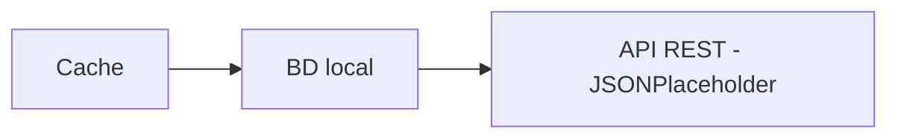

# RepositorioRemoto


Práctica 6 de Desarrollo Web en Entorno Servidor (DWES), unidad 1.

Es un servicio en .NET 10 que maneja usuarios guardándolos en tres sitios distintos:
una caché, una base de datos local y la API REST de JSONPlaceholder.
La gracia está en que el programa decide solo a cuál de los tres tiene que ir en
cada momento.

**Autores:** Cristian Álvarez · Jesús Cobo

---

## 🎯 Qué hace

La idea es tener siempre una copia local de los usuarios de
[JSONPlaceholder](https://jsonplaceholder.typicode.com/users) y poder hacer el CRUD
completo sobre ella sin tener que salir a internet cada vez.

- Al arrancar borra la base local y la vuelve a cargar desde la API.
- Cada 60 segundos repite esa sincronización él solo, en segundo plano.
- Cada vez que se crea, actualiza o borra un usuario lo avisa por un flujo reactivo
  y sale por consola.
- Puede exportar todos los usuarios a un fichero JSON.

Funciona con dos perfiles: **Development** (SQLite + caché en memoria) y
**Production** (PostgreSQL + Redis). Se cambia de uno a otro con una variable de
entorno, sin tocar código.

---

## 🏗️ Arquitectura

### Los tres niveles



Funciona como una cafetería: primero miras la vitrina, si no hay bajas al almacén, y
si tampoco hay llamas al proveedor. Cuando llega, lo repones en los dos sitios para que
la próxima vez lo encuentres a la primera.

| Operación | Por dónde pasa |
|---|---|
| Obtener todos | BD local. Si está vacía, va a la API, lo guarda y lo devuelve |
| Obtener por id | Caché → BD local → API. Cada nivel rellena los de arriba |
| Crear, actualizar y borrar | API → BD local → caché → notificación |
| Sincronizar (cada 60 s) | Vacía la caché, vacía la BD y recarga todo desde la API |

La caché solo entra en juego al obtener por id. Es lo que pide el enunciado, así que
no la hemos metido en el "obtener todos" aunque se podría.

### Las capas

```
Program.cs → UserService → Validator
                         → CacheService          (memoria o Redis)
                         → UserRepository        (EF Core: SQLite o PostgreSQL)
                         → UserRemoteRepository  (Refit + JSONPlaceholder)
                         → NotificationService   (Rx.NET)
```

El `UserService` es el que manda: él decide el orden y las demás clases solo hacen
su trabajo. Y le da igual qué caché o qué base de datos haya detrás, porque solo
conoce las interfaces.

Los errores no se lanzan como excepciones. Cada operación devuelve un
`Result<T, DomainError>` de CSharpFunctionalExtensions, así que el que llama siempre
sabe si la cosa fue bien o mal sin tener que envolver nada en un try/catch. Los únicos
sitios donde sí capturamos excepciones son los dos bordes del programa: Refit, cuando
la API responde mal (`ApiException`), y el disco, al exportar el JSON (`IOException`).
Ahí las traducimos a `DomainError` y a partir de ese punto ya nadie vuelve a ver una
excepción.

---

## 📁 Estructura del proyecto

```
RepositorioRemoto/
├── Api/              Cliente Refit de JSONPlaceholder
├── Cache/            Contrato de caché y sus dos implementaciones
├── Config/           Clases de configuración, una por sección del appsettings
├── Dto/              DTOs de petición y de respuesta
├── Entity/           Entidad de EF Core y el DbContext
├── Errors/           DomainError y su factoría
├── Infrastructure/   Registro de las dependencias
├── Mappers/          Conversiones entre DTO, modelo y entidad
├── Models/           El modelo de dominio
├── Notifications/    Servicio de notificaciones con Rx
├── Repositories/     Repositorio local y repositorio remoto
├── Services/         UserService, el que orquesta los tres niveles
├── Sync/             Sincronización y la tarea en segundo plano
├── Validators/       Validación de las peticiones
└── Program.cs        Arranque y demostración

RepositorioRemoto.Tests/   65 tests con NUnit, Moq y FluentAssertions
```

Cada carpeta tiene una responsabilidad y solo una. Si algo no encaja en ninguna,
probablemente esté mal pensado.

---

## 📋 Requisitos

- **.NET 10 SDK**
- **Docker** para dos cosas: los tests del repositorio local, que levantan un
  PostgreSQL de verdad con TestContainers, y el perfil de producción, que necesita
  PostgreSQL y Redis. Para ejecutar en desarrollo no hace falta.
- Conexión a internet, porque la API es pública y está fuera.

---

## ▶️ Cómo ejecutarlo

```bash
dotnet run --project RepositorioRemoto
```

Arranca en perfil **Development**, que usa SQLite y caché en memoria. No necesita
levantar nada antes: la base de datos se crea sola la primera vez.

### Perfil de producción

Usa PostgreSQL y Redis, así que primero hay que levantarlos:

```bash
docker compose up -d
```

Y luego se cambia de perfil con la variable de entorno `DOTNET_ENVIRONMENT`:

```powershell
# PowerShell
$env:DOTNET_ENVIRONMENT="Production"; dotnet run --project RepositorioRemoto
```

```bash
# Linux y macOS
DOTNET_ENVIRONMENT=Production dotnet run --project RepositorioRemoto
```

Lo que verás al arrancar: carga los 10 usuarios de la API, hace una demostración de
las seis operaciones y se queda esperando. Si lo dejas correr un minuto, salta sola
la sincronización periódica. Con **ENTER** se para.

---

## ⚙️ Configuración

La configuración está repartida en tres ficheros que se van montando uno encima de otro:

| Fichero | Qué lleva |
|---|---|
| `appsettings.json` | Lo común a todos los perfiles |
| `appsettings.Development.json` | Lo propio de desarrollo: SQLite y caché en memoria |
| `appsettings.Production.json` | Lo propio de producción: PostgreSQL y Redis |

Primero se carga el común y después el del perfil, que pisa lo que coincida. Por eso
`CacheSettings` aparece en dos sitios: la caducidad es la misma siempre, pero el
proveedor cambia según dónde estés.

### Lo común — `appsettings.json`

| Clave | Para qué | Valor |
|---|---|---|
| `ApiSettings:BaseUrl` | Dirección de la API remota | `https://jsonplaceholder.typicode.com` |
| `CacheSettings:ExpirationSeconds` | Cuánto vive cada entrada en la caché | `60` |
| `SyncSettings:IntervalSeconds` | Cada cuánto sincroniza la tarea de fondo | `60` |
| `ExportSettings:OutputDirectory` | Carpeta donde deja el JSON exportado | `output` |
| `ExportSettings:FileName` | Nombre del fichero exportado | `usuarios.json` |

### Development

| Clave | Valor |
|---|---|
| `DatabaseSettings:Provider` | `Sqlite` |
| `DatabaseSettings:ConnectionString` | `Data Source=usuarios.db` |
| `CacheSettings:Provider` | `Memory` |

### Production

| Clave | Valor |
|---|---|
| `DatabaseSettings:Provider` | `PostgreSQL` |
| `DatabaseSettings:ConnectionString` | Cadena de conexión a Postgres |
| `CacheSettings:Provider` | `Redis` |
| `CacheSettings:RedisConnectionString` | `localhost:6379,allowAdmin=true` |

El `allowAdmin=true` hace falta porque `ClearAsync` usa `FLUSHDB`, que Redis trata
como comando de administración y bloquea por defecto. Sin él, la sincronización
fallaría al intentar vaciar la caché.

Las dos claves `Provider` son las que deciden qué implementación se registra al
arrancar. Eso pasa en `Infrastructure/DependenciesProvider.cs`: lee el valor y elige.
Cambiar de SQLite a PostgreSQL, o de memoria a Redis, es cambiar una palabra en un
JSON, sin tocar una sola línea de código.

Cada sección tiene su propia clase en `Config/`, con su `SectionName` dentro, y se
inyectan con `IOptions<T>`. Así nadie anda buscando claves sueltas por el código.

---

## 🧠 Decisiones de diseño

### El usuario con id 11

JSONPlaceholder es un simulador: no guarda nada. Da igual cuántos usuarios crees, el
POST siempre responde con el **mismo id, el 11**. Así que al segundo intento chocaría
con el que ya habías guardado en la base local.

Lo resolvemos así: guardamos el usuario con el id que nos dé la API, pero antes
comprobamos si ya lo tenemos. Si está, devolvemos `DomainError.AlreadyExists` en vez
de reventar con un error de clave duplicada.

### El 404 siempre significa lo mismo

Cuando la API responde 404, lo traducimos a `DomainError.NotFound` en las tres
operaciones que pueden recibirlo: obtener por id, actualizar y borrar. Parece obvio,
pero es fácil que se cuele una donde el 404 acabe saliendo como un error genérico de
API. Un mismo fallo tiene que contarse siempre igual.

### Si la API dice que sí, es que sí

Puede pasar que la API borre o actualice un usuario que la base local no tenía.
En ese caso no devolvemos error: la API es la fuente de verdad, así que la operación
ha salido bien. Dejamos un aviso en el log y seguimos. Además, la sincronización de
los 60 segundos vacía y recarga la base local, con lo que ese desajuste se arregla solo.

### La tabla es plana

El usuario de JSONPlaceholder trae cosas dentro de cosas: una dirección, y dentro de
ella unas coordenadas, y aparte una empresa. En el modelo de dominio eso son records
anidados, que es lo natural. Pero en la base de datos lo guardamos **plano**: una
columna por campo (`street`, `city`, `lat`, `lng`, `company_name`...).

Se podría haber hecho con tipos propiedad de EF Core, pero eso no entra en el temario
de la unidad. Un mapper que aplana al guardar y reconstruye al leer hace el mismo
trabajo con herramientas que sí hemos dado.

### Las dos cachés se comportan igual

`MemoryCacheService` guarda el objeto tal cual en la memoria del proceso. Redis es
otro programa al otro lado de un socket y solo entiende texto, así que
`RedisCacheService` serializa a JSON al guardar y deserializa al leer.

Por dentro son muy distintas, pero hacia fuera tienen que ser idénticas: las dos
aplican la misma caducidad de `CacheSettings:ExpirationSeconds` cuando no se les pasa
una. Si no, la aplicación cambiaría de comportamiento solo por cambiar de perfil, y
eso es justo lo que una interfaz tiene que evitar.

### Se valida al crear y al actualizar

El enunciado solo nombra un validador de creación. Nos pareció una laguna: si validas
el POST pero no el PUT, puedes dejar un usuario sin nombre o sin email actualizándolo.
Por eso la clase se llama `UserValidator` y no `CreateUserRequestValidator`, y cubre
las dos operaciones.

### El servicio devuelve DTOs, no el modelo

`UserService` devuelve `UserResponseDto`. El modelo de dominio se queda dentro y no
sale de la aplicación. La caché sí guarda el modelo, porque es interna.

### Las notificaciones son una radio, no un podcast

El servicio de notificaciones solo emite; quien quiera escuchar se suscribe. El que
imprime en consola es `Program.cs`, no el servicio.

Y es un observable **caliente**: lo que pasa antes de que te suscribas se pierde. Por
eso en `Program.cs` la suscripción está puesta **antes** de la carga inicial. Si se
pone después, los eventos del arranque no los ve nadie. Hay un test que comprueba
justo eso.

### Los repositorios devuelven valores pelados

Los repositorios devuelven `null` o `false` cuando no encuentran algo, no un `Result`.
Es el servicio el que convierte eso en un `DomainError` con sentido. Así el repositorio
solo se ocupa de guardar y leer, y las reglas de negocio están en un único sitio.

---

## ✅ Tests

```bash
dotnet test
```

**65 tests**, todos con NUnit, Moq y FluentAssertions, siguiendo el patrón AAA
(Arrange, Act, Assert) y separados en `CasosPositivos` y `CasosNegativos`.

| Qué se prueba | Nº |
|---|---|
| Mappers | 6 |
| Errores de dominio | 5 |
| Validador | 9 |
| Repositorio local (TestContainers) | 11 |
| Sincronización | 5 |
| Repositorio remoto | 6 |
| Caché | 5 |
| UserService | 13 |

Dos cosas sobre cómo están hechos:

> [!NOTE]
> **Los 11 del repositorio local necesitan Docker arrancado.** Levantan un PostgreSQL
> real con TestContainers en vez de simularlo. Si Docker Desktop no está en marcha,
> esos 11 fallan y los otros 54 pasan igual.

**Los del `UserService` no solo miran lo que devuelve, sino a quién llama.** Por
ejemplo, cuando un usuario está en la caché se comprueba que la base de datos **no
se toca** (`Times.Never`). Si alguien rompiera el atajo de la caché, el valor
devuelto seguiría siendo correcto y el test del valor pasaría — pero el programa
estaría yendo al disco cada vez. Esa comprobación es la única que lo pilla.

---

## 🧰 Tecnologías

| Para qué | Qué se usa |
|---|---|
| Caché en memoria (perfil Dev) | `Microsoft.Extensions.Caching.Memory` |
| Caché distribuida (perfil Prod) | StackExchange.Redis |
| Base de datos local | EF Core: SQLite en Dev, PostgreSQL en Prod |
| Cliente HTTP tipado | Refit |
| Errores sin excepciones | CSharpFunctionalExtensions (`Result<T, DomainError>`) |
| Logging | Serilog, a consola y a fichero con rotación diaria |
| Notificaciones | System.Reactive (Rx.NET) |
| Inyección de dependencias | `Microsoft.Extensions.DependencyInjection` |
| Infraestructura | Docker Compose (PostgreSQL + Redis) |
| Tests | NUnit + Moq + FluentAssertions + TestContainers |

---

